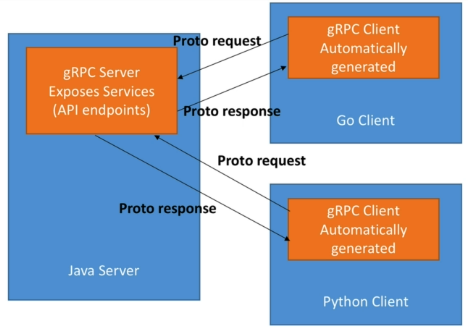

# Protocol Buffer

## Introduction:

...


## Advantages

- Data is fully typed
- Data is compressed automatically (binary and efficiently serialized), so it consumes less CPU
- Schema (defined using .proto file) is needed to generate code and read the data
- Documentation can be embedded in the schema
- Data can be read across any language (C#, Java, Go, Python, JavaScript, etc...)
- Schema can evolve over time, in a safe manner (schema evolution)
- 3-10x smaller, 20-100x faster than XML
- Code is generated for you automatically
- Very convenient for transporting a lot of data
- Allows for easy API evolution using rules


## Disadvantages:

- Protobuf support for some languages might be lacking (but the main ones is fine)
- Can't "open" the serialized data with a text editor (because it's compressed and serialized)


## Message

```protobuf
// The syntax for this file is proto3
syntax = "proto3";

/*
 * Sample comment
 */

message Person {
    int32 age = 1;
    string first_name = 2;
    string last_name = 3;
    bytes small_picture = 4;  // .jpg image file
    bool profile_verified = 5;
    float height = 6;  // height of the person in cms
    
    // a list of phone numbers that is optional to provide at signup
    repeated string phone_numbers = 7;

    // we currently consider only 3 eye colors
    enum EyeColor {
        UNKNOWN_EYE_COLOR = 0;
        EYE_GREEN = 1;
        EYE_BROWN = 2;
        EYE_BLUE = 3;
    }

    // it's an enum as defined above
    EyeColor eye_color = 8;
}
```

__Note:__ We can define multiple messages in one `.proto` file for referencing.

### Scalar Types

- Number: double, float, int32, int64, ...
- Boolean: `True` or `False`
- String: Must always contain UTF-8 encoded text
- Byte: It's up to you to interpret what these bytes mean. Maybe a small image, zip file, or whatever


### Tags

- In Protocol Buffers, field names are not important, tags are more important.
- Tag range: __1 - 2<sup>29</sup>__ (~ 536,870, 911)
    - __1 - 15__: Use 1 byte in space, so use them for frequently populated fields
    - __16 - 2047__: 2 bytes
    - __19000 - 19999__: Cannot be used, they are reserved by Google for special uses


### Repeated Fields

To use "list" or "array", we can use repeated fields.


### Comments

There are 2 types of comment _(the formats are like in PHP, Javascript)_:
- `// My comment`
- `/* My comment */`


### Default Values for Fields

All fields, if not specified or unknown, will take a default value.

__Note:__ Required or optional fields are not available.

- __bool:__ false
- __number:__ 0
- __string:__ empty string
- __bytes:__ empty bytes
- __enum:__ first value
- __repeated:__ empty list


### Import

We can import various `message` from other `.proto` files for re-utilization without duplicating code. Note that we have to __use paths from content root__.

```protobuf
// file content/root/path/address.proto
syntax = "proto3";

message Address {

}
```

```protobuf
// file content/root/path/person.proto
syntax = "proto3";

import "content/root/path/address.proto";

message Person {
    Address address = 1;
}
```


### Package (or namespace)

We can define `message` inside a package using `package` keyword. After importing, remember that we have to use the package name to access a `message`.


```protobuf
// file content/root/path/address.proto
syntax = "proto3";

package my.address;

message Address {

}
```

```protobuf
// file content/root/path/person.proto
syntax = "proto3";

import "content/root/path/address.proto";

message Person {
    my.address.Address address = 1;
}
```


### Code generation with Python

Assume we already have an existing `post.proto` file. We will generate Python code for this file. The code will be used creating & reading Protocol Buffer objects.

```bash
# this command will generate python code
protoc \
    --proto_path=course/3-python-code-generation \
    --python_out=course/3-python-code-generation \
    course/3-python-code-generation/*.proto

# or access directly to the directory
cd course/3-python-code-generation
protoc --proto_path=. --python_out=. *.proto
```


## Service

- Protocol buffers can define Services on top of Messages
- A service is a set of endpoints your application can be accessible from
- Services need to be interpreted by a framework to generate associated code

```protobuf
service SearchService {
    rpc Search (SearchRequest) return (SearchResponse);
}
```

- Flow:



## Protobuf Data Evolution

### Problems

- When an application scales, some fields may change, some will be added or removed.
- So you need to be able to evolve the source data without breaking the other applicantions reading it.
- Scenarios for updating protocols:


### Updating Protocol Rules

- Don't change the __numeric tags__ for any existing fields
- You can add new fields, and old code will just ignore them
- Likewise, if the old / new code reads unknown data, the default will take place
- Renaming is fine (it just maps data by tags)
- Fields can be removed, as long as the tag number is not used again in your updated message type
- For data type changes (not recommended), refer to the documentation

1. Removing Fields - Reserved Tags

- When removing a field, you should always reserve the tag and the name (`reserved` keyword)
    - Prevent the tag and the name to be re-used
    - Prevent conflicts in the codebase

- Can use `OBSOLETE_field_name` instead, but it has some drawbacks (check it out in the documentation).

```protobuf
// old format
message MyMessage {
    int32 id = 1;
    string first_name = 2;
}

// new format (remove first_name)
message MyMessage {
    reserved 2;
    reserved "first_name";
    int32 id = 1;

    //
}
```

__Note:__ We should not ever remove any reserved tags.


2. Beware of Defaults

- They allows us to easily evolve Protobuf files without breaking any existing or new codes
- They also ensure we know that a field will always have a non-null values

- __Danger:__ You cannot differentiate from a missing field or if a value equal to the default was set

=> Make sure the default value doesn't have meaning for your business


## gRPC

- At a high level, it allows you to define REQUEST and RESPONSE for RPC (Remote Procedure Calls) and handles all the rest for you

- On top of it, it's modern, fast and efficient, build on top of HTTP/2, low latency, supports streaming, language independent, and makes it super easy to plug in authentication, load balancing, logging and monitoring


### What's an RPC?

- An RPC is a Remote Procedure Call
- In your CLIENT code, it looks like you're just calling a function directly on the SERVER


### How to get started?

- At the core of gRPC, you need to define the messages and services using Protocol Buffers
- The rest of the gRPC code will be generated for you and you'll have to provide an implementation for it
